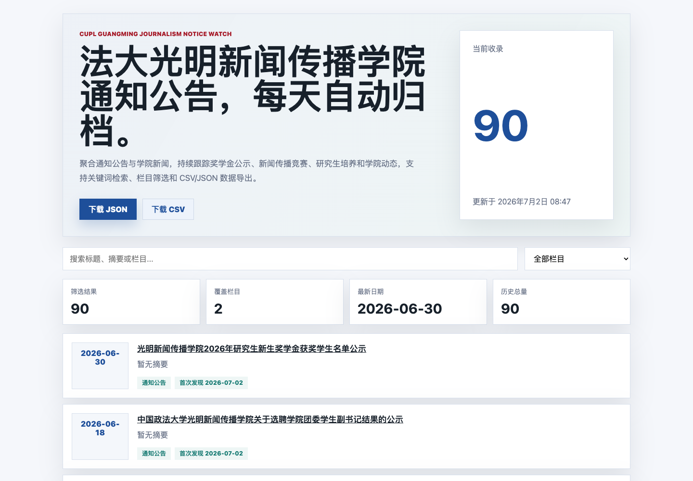

# 中国政法大学光明新闻传播学院通知公告观察站

[English README](README.md)

这是一个非官方的中国政法大学光明新闻传播学院公开通知公告归档项目。它每天抓取学院网站的“通知公告”和“学院新闻”栏目，保存历史数据，并生成一个可以直接打开的静态公告看板。



## 项目用途

光明新闻传播学院的奖学金公示、学生组织通知、新闻传播竞赛、研究生培养和学院新闻具有明显时效性。本项目把公开网页中的公告整理成结构化数据，方便检索、导出、归档和后续做跨学院聚合。

## 目标站点

- 站点：中国政法大学光明新闻传播学院
- 官方主页：https://sjc.cupl.edu.cn/
- 通知公告：https://sjc.cupl.edu.cn/xydt/tzgg1.htm
- 学院新闻：https://sjc.cupl.edu.cn/xydt/xyxw.htm
- 项目性质：非官方项目，仅归档公开网页信息，不代表中国政法大学官方。

## 快速开始

```bash
python3 scraper.py 3
python3 -m http.server 8000
```

然后打开 `http://localhost:8000` 查看公告看板。

## 功能

- 抓取公告标题、日期、链接、栏目、来源页面和抓取时间。
- 对列表页截断标题自动访问详情页补全。
- 增量合并历史数据，重复运行不会重复插入同一公告。
- 输出 JSON、CSV 和每日历史快照。
- 静态前端支持关键词搜索、栏目筛选、统计卡片、更新时间和数据下载。
- 包含 GitHub Actions 示例，可配置为每天自动抓取并提交数据更新。

## 数据结构

主要文件：

- `data/notices.json`：合并后的完整公告归档。
- `data/notices.csv`：适合 Excel 或数据分析工具打开的表格。
- `data/history/YYYY-MM-DD.json`：每天单次抓取的快照。
- `data/meta.json`：站点、更新时间、栏目、总数等元信息。

字段说明：

- `title`：公告或新闻标题。
- `date`：页面展示日期，规范化为 `YYYY-MM-DD`。
- `url`：原文链接。
- `summary`：列表页摘要，如页面提供。
- `section`：来源栏目，例如“通知公告”“学院新闻”。
- `source_url`：本次抓取的栏目页。
- `first_seen_at` / `last_seen_at`：首次和最近一次抓取时间。

## 定时更新

`.github/workflows/update.yml` 示例会每天运行：

```bash
python3 scraper.py 3
```

并提交 `data/` 目录中的变化。若远程仓库中没有 workflow 文件，需要给 GitHub token 增加 `workflow` 写权限后重新上传。

## 免责声明

本项目只抓取公开网页信息，不绕过访问控制，不抓取个人隐私数据，不代表中国政法大学或光明新闻传播学院官方。涉及培养、学位、奖学金、竞赛和活动等事项时，请以学院官方网站发布内容为准。

## 后续扩展

- 聚合更多中国政法大学学院和处室站点。
- 增加 RSS/Atom 订阅。
- 对公告变更做差异追踪。
- 发布 GitHub Pages 在线看板。

## License

MIT
